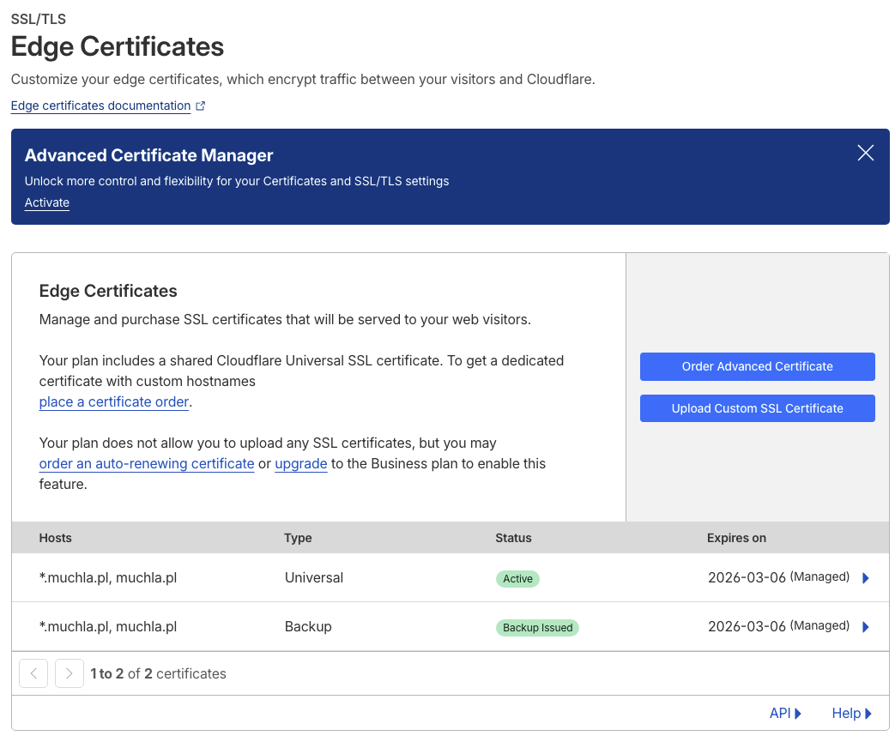

# DNS Setup (Cloudflare)

Każda z czterech domen korzysta z Cloudflare DNS.

## Rekordy

### 1. Rekordy A

- `muchla.pl` → publiczny adres VPS (proxied)
- `www.muchla.pl` → CNAME na `muchla.pl`

### 2. Rekordy CNAME

- Warianty www lub aliasy migracyjne.

---
### 3. CAA

## Proxy (Orange Cloud)

Wszystkie domeny mają aktywny Cloudflare Proxy:

- CF ukrywa IP VPS,
- ochrona przed DDoS,
- caching dla statycznych zasobów.

## SSL/TLS

- Tryb: **Full Strict**
- Origin: Let’s Encrypt
- Edge: certyfikaty CF

## Page Rules

Używane do:

- przekierowań .pl → .com,
- wymuszania HTTPS,
- ustawienia cache dla statycznych plików (opcjonalnie).
