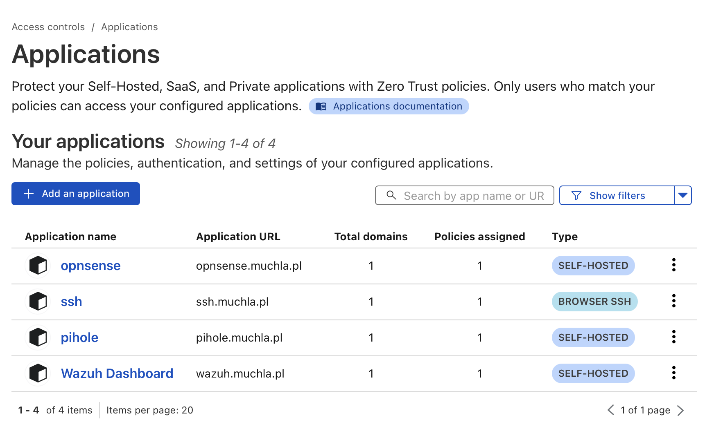
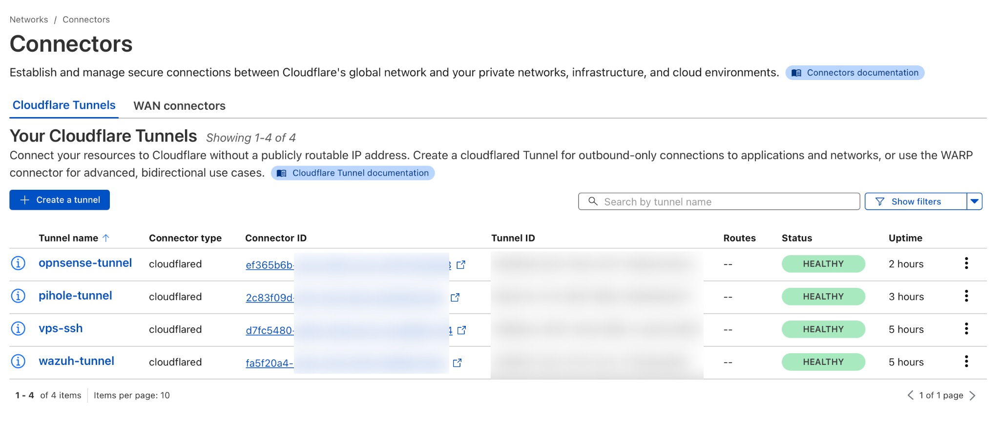
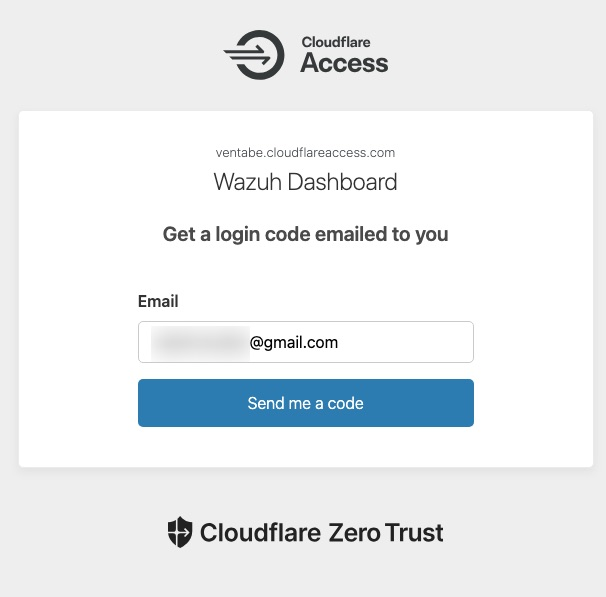
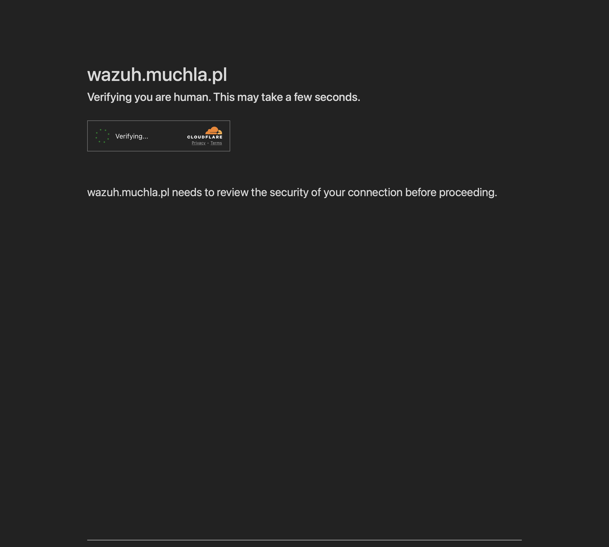
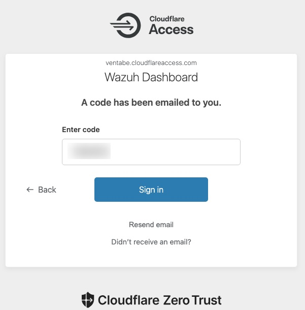
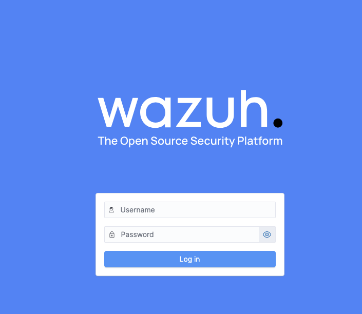
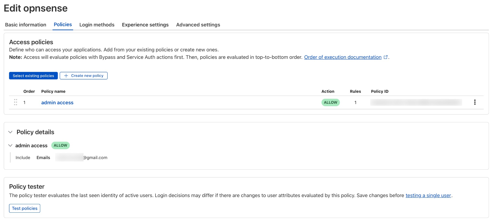
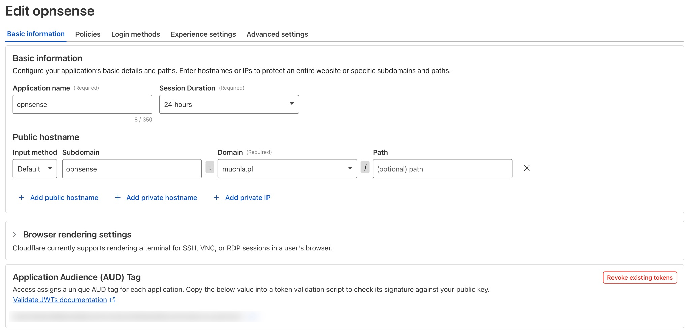
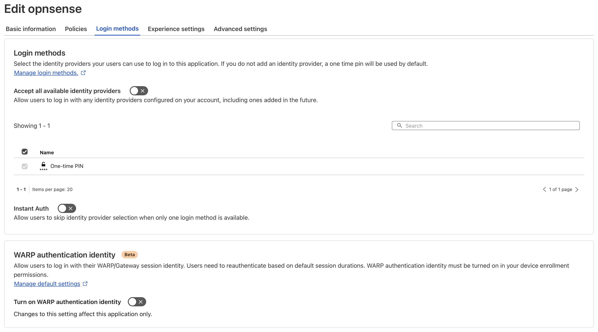
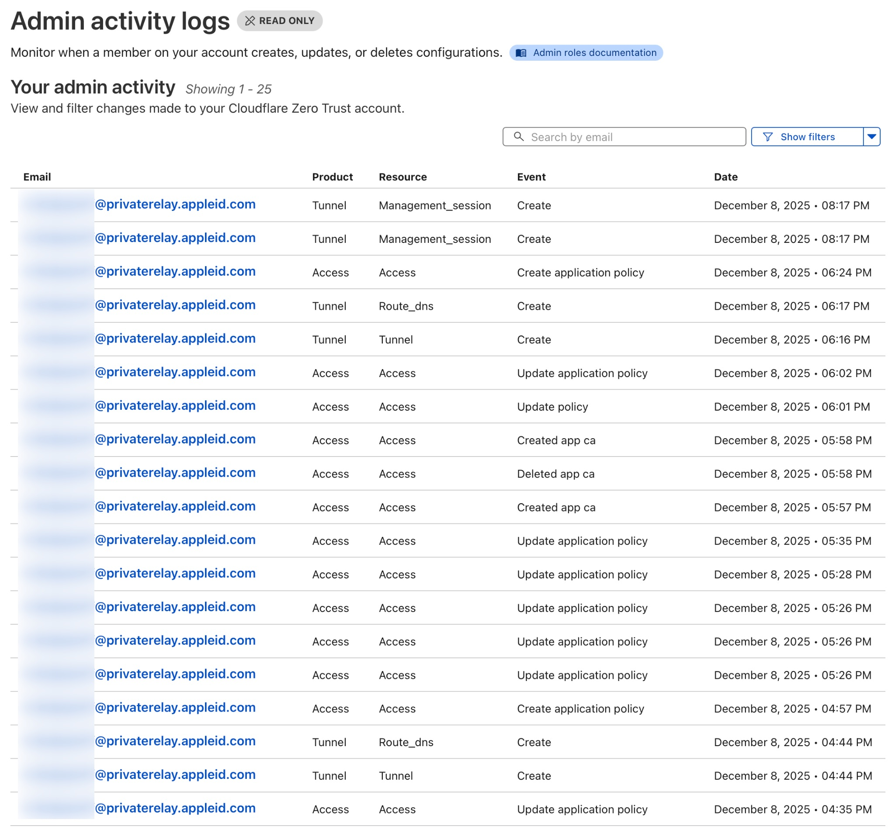

# Cloudflare Zero Trust

> Praktyczne wdrożenie architektury Zero Trust dla infrastruktury homelabowej obejmującej 3 lokalizacje, z eliminacją tradycyjnych wymagań VPN i otwartych portów.

## 🎯 Założenia

- ✅ **Zero Trust Access** dla 4+ wewnętrznych serwisów z obowiązkowym MFA
- ✅ **Łączność wielolokalizacyjna** przez Cloudflare Tunnel (3 lokalizacje)
- ✅ **Zero otwartych portów** - kompletna ochrona origin IP
- ✅ **Dostęp oparty na tożsamości** - email OTP + ograniczenia geograficzne
- ✅ **Pełny audit trail** - kompleksowe logowanie dostępu
- ✅ **Wysoka dostępność** - 4 redundantne połączenia tunelowe per serwis

---

## 🛠 Technologia

### Infrastruktura


### Bezpieczeństwo i monitoring


### Hardware


---

## 🚀 Wdrożone serwisy

| Serwis         | Lokalizacja    | Dostęp             | Funkcje                                                    |
| -------------- | -------------- | ------------------ | ---------------------------------------------------------- |
| **Wazuh SIEM** | Lokalizacja B  | wazuh.muchla.pl    | Monitoring bezpieczeństwa, 7+ agentów, centralne logowanie |
| **Pi-hole**    | Raspberry Pi 5 | pihole.muchla.pl   | Filtrowanie DNS, blokowanie reklam, deployment Docker      |
| **OPNsense**   | Lokalizacja A  | opnsense.muchla.pl | Zarządzanie firewallem, konfiguracja VLAN, brama VPN       |
| **SSH (VPS)**  | OVH Cloud      | ssh.muchla.pl      | Terminal w przeglądarce, zabezpieczony MFA                 |

**Wszystkie serwisy wymagają:**

- ✅ Uwierzytelnienia opartego na emailu
- ✅ Jednorazowego kodu PIN (OTP) przez email
- ✅ Zarządzania sesją (24 godziny)
- ✅ Kompleksowego logowania audytu

---

##  Zero Trust Access

### Aplikacje Zero Trust Access



_Cztery aplikacje self-hosted chronione przez polityki Zero Trust: Wazuh SIEM, Pi-hole DNS, OPNsense Firewall oraz terminal SSH_

---

### Aktywne Tunele Cloudflare



_Wszystkie cztery tunele pokazujące status HEALTHY z uptimem 2-5 godzin w rozproszonych instancjach konektorów_

---

### Przepływ Uwierzytelniania Wieloskładnikowego

**Krok 1: Weryfikacja Email**



_Formularz logowania z prośbą o adres email_

---

**Krok 2: Weryfikacja Turnstile**



_Cloudflare Turnstile - ochrona przed botami_

---

**Krok 3: Wprowadzenie Kodu OTP**



_Wprowadzenie 6-cyfrowego kodu jednorazowego wysłanego na email_

---

**Krok 4: Pomyślny dostęp**



_Dashboard Wazuh po pomyślnym uwierzytelnieniu_

---

**Kompletny przepływ uwierzytelniania** demonstrujący weryfikację tożsamości opartą na emailu z jednorazowym kodem PIN oraz ochroną Cloudflare Turnstile przed botami.

---

### Konfiguracja Polityki Dostępu



_Przykładowa polityka: Włączenie oparte na emailu z czasem trwania sesji 24 godziny_

---

### Konfiguracja Aplikacji

**Ustawienia Podstawowe**



_Konfiguracja hostname i czasu trwania sesji_

---

**Metody Logowania**



_One-time PIN włączony jako domyślna metoda uwierzytelniania_

---

**Polityki Dostępu**


_Szczegółowa konfiguracja pokazująca setup hostname, uwierzytelnianie One-time PIN oraz szczegółową kontrolę dostępu_

---

### Audyt aktywności infrastruktury



_Kompleksowe logowanie wszystkich zmian w infrastrukturze: tworzenie tuneli, routing DNS oraz aktualizacje polityk_

---

## 🔐 Funkcje bezpieczeństwa

### Wdrożenie Zero Trust

**Brak wymaganego VPN**

- Bezpośredni dostęp przez Cloudflare Edge
- Eliminacja tradycyjnych endpointów VPN jako powierzchni ataku

**Brak otwartych portów**

- Serwery origin całkowicie ukryte
- Dostęp wyłącznie przez Cloudflare Tunnel z wychodzącymi połączeniami

**Weryfikacja tożsamości**

- Email + OTP dla każdego dostępu
- Brak dostępu opartego na sieci - tylko weryfikacja użytkownika

**Ograniczenia geograficzne**

- Opcjonalna kontrola dostępu oparta na kraju
- Możliwość ograniczenia do określonych zakresów IP

**Zarządzanie sesją**

- Konfigurowalny timeout (1-24 godziny)
- Automatyczne wylogowanie po okresie nieaktywności
- Możliwość wymuszenia ponownego uwierzytelnienia

---

## 📋 Szczegóły Ttchniczne

### Konfiguracja Tuneli

Każdy tunel używa następującej struktury:

```yaml
tunnel:
credentials-file: /etc/cloudflared/.json

ingress:
  - hostname: service.muchla.pl
    service: https://local-ip:port
    originRequest:
      noTLSVerify: true # Dla self-signed certificates

  - service: http_status:404 # Catch-all
```

**Kluczowe cechy:**

- Wychodzące połączenia z origin (outbound-only)
- Brak wymagania public IP
- Automatyczne load balancing między 4 połączeniami
- Failover w przypadku awarii połączenia

---

### Polityki Dostępu

Standardowa polityka dla wszystkich serwisów:

```
Policy Name: Admin Access
Action: Allow

Include:
  - Emails: authorized-user@gmail.com

Require:
  - One-time PIN (email OTP)

Optional:
  - Country: Poland
  - IP ranges: 10.8.0.0/24 (VPN network)

Session Duration: 24 hours
```
